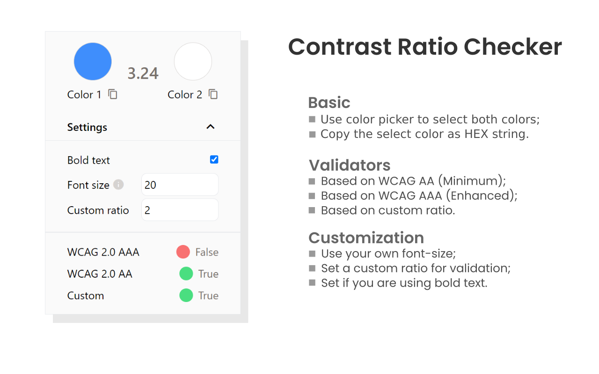

<h1></h1>

## Contrast Ratio Checker Extension

Improve your website accessibility with this tool that follows Web Content Accessibility Guidelines (WCAG) to calculate the contrast ratio between colors, plus offering validators based on WCAG AA (minimum), WCAG AAA (enhanced) and custom ratio.

### License

Copyright © 2023, [Vinícius R. Vieira](https://github.com/viniciusrvieira). Released under the [MIT License](/LICENSE).
